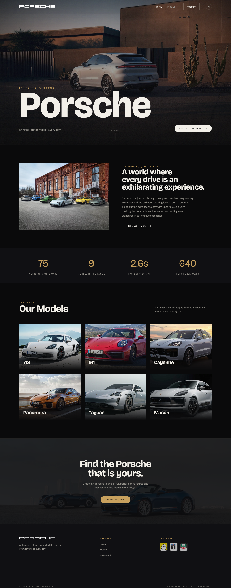
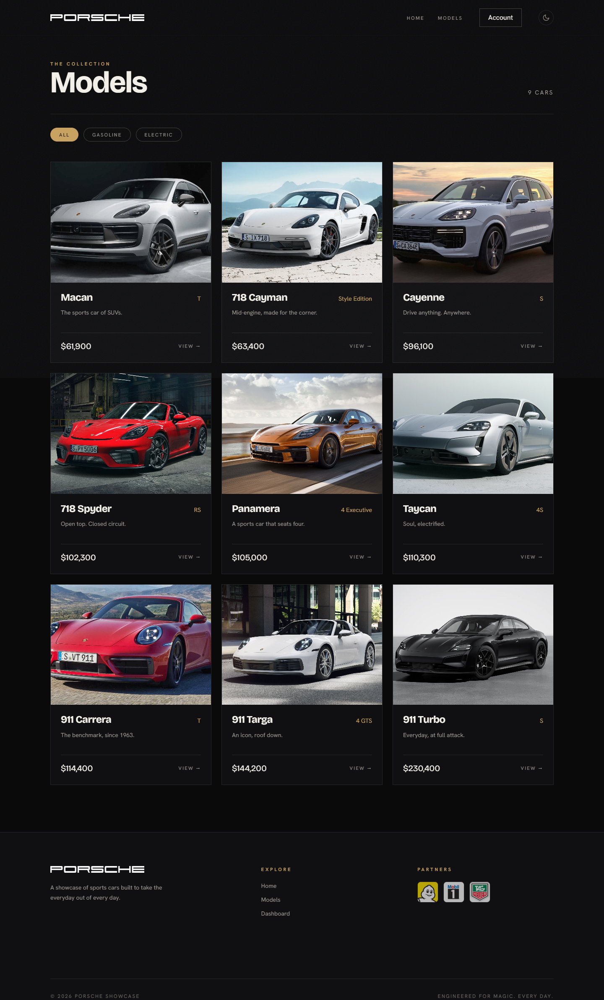
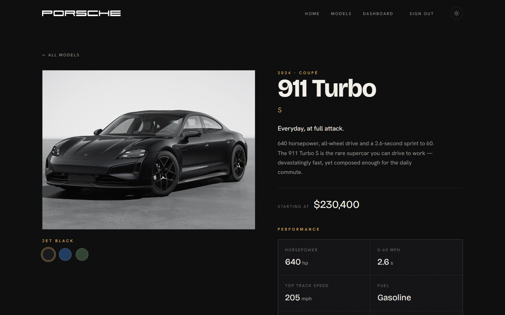
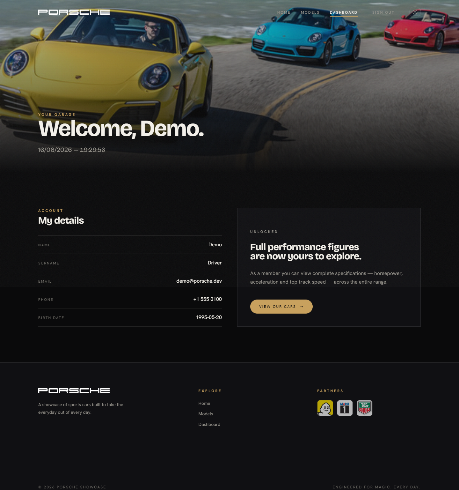
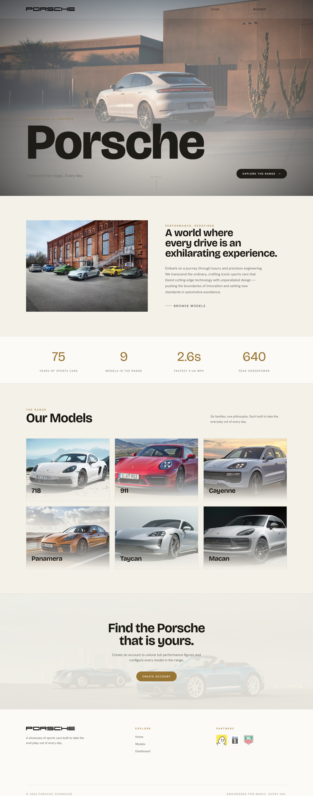

# Porsche Showcase

A full-stack Porsche showcase site: browse the model range, create an account, and
unlock full performance figures for every car. The frontend is built in **plain
HTML, CSS and JavaScript** — no framework, no build step — backed by a small,
secure REST API.



## Highlights

- **Hand-written vanilla frontend** — semantic multi-page HTML, a single modern CSS
  stylesheet, and ES modules. No framework and no bundler; the browser runs the code
  as written.
- **Slick, responsive UI** with a dark/light theme toggle, scroll-reveal motion, a
  film-grain finish, and a cohesive editorial design system driven by CSS variables.
- **Real authentication** — bcrypt-hashed passwords and JWTs delivered via `httpOnly`
  cookies, with the session restored on every page load.
- **Auth-gated content** — anyone can browse models, but full performance specs are
  revealed only to signed-in users, enforced on the server, not just in the UI.
- **Zero-setup database** — SQLite via `better-sqlite3`, seeded with one command. No
  external database to install, and one server process hosts both the API and the site.

## Tech stack

| Layer    | Tools |
| -------- | ----- |
| Frontend | HTML5, modern CSS (custom properties, grid, `clamp`), vanilla JS (ES modules, `fetch`, IntersectionObserver) |
| Backend  | Node.js, Express, TypeScript, SQLite (`better-sqlite3`), Zod, JWT, bcrypt |

## Project structure

```
.
├── public/              # the vanilla frontend, served as static files
│   ├── index.html       # Home
│   ├── shop.html        # Models listing
│   ├── car.html         # Model detail (?id=)
│   ├── login.html
│   ├── signup.html
│   ├── dashboard.html
│   ├── 404.html
│   ├── css/styles.css   # design tokens + all styling
│   ├── js/              # api client, shared layout, one module per page
│   └── img/             # car & brand imagery
└── server/              # Express API + static host
    └── src/
        ├── routes/      # /auth and /cars
        ├── middleware/  # auth + error handling
        ├── lib/         # token helpers
        ├── data/        # seed catalog
        ├── db.ts        # schema + connection
        ├── seed.ts      # (re)seed the database
        └── index.ts     # serves the API and public/
```

## Getting started

Requires Node.js 18+.

```bash
# install dependencies
npm install

# create and seed the SQLite database
npm run seed

# start the server (API + site) on http://localhost:4000
npm run dev
```

Then open <http://localhost:4000>.

**Demo account:** `demo@porsche.dev` / `demo1234`

### Useful scripts

| Command         | What it does                                  |
| --------------- | --------------------------------------------- |
| `npm run dev`   | Start the server with live reload (`tsx watch`) |
| `npm run seed`  | Rebuild the catalog and demo user             |
| `npm run build` | Type-check and compile the server             |
| `npm start`     | Run the compiled server (after `npm run build`) |

The server reads optional config from `server/.env` (see `server/.env.example`). The
defaults work out of the box for local development.

## API

| Method | Route             | Description                                   |
| ------ | ----------------- | --------------------------------------------- |
| POST   | `/api/auth/signup`| Create an account, sets the auth cookie       |
| POST   | `/api/auth/login` | Sign in, sets the auth cookie                 |
| POST   | `/api/auth/logout`| Clear the session                             |
| GET    | `/api/auth/me`    | Current user (requires auth)                  |
| GET    | `/api/cars`       | Public catalog summary                        |
| GET    | `/api/cars/:id`   | Model detail — performance specs require auth |

## How the frontend works

There is no build tooling — the files in `public/` are what the browser runs.

- **Layout without a framework.** `js/layout.js` injects the shared header and footer
  into each page, wires the theme toggle, scroll-aware header, and mobile menu, and
  runs an `IntersectionObserver` for the scroll-reveal animations.
- **Theming with CSS variables.** Every color is a custom property; the light theme
  simply overrides those variables under `:root[data-theme="light"]`, so the whole UI
  flips without touching any markup. An inline script applies the saved theme before
  first paint to avoid a flash.
- **Data over `fetch`.** `js/api.js` is a tiny wrapper around `fetch` (credentials
  included for the auth cookie) that the model list, detail, and auth pages call.
- **Same-origin.** Express serves both the static site and the API, so there is no CORS
  layer and the auth cookie just works.

## What changed from the original

The first version was a university project: vanilla HTML/CSS/JS with a PHP + PostgreSQL
backend. This rebuild keeps the same hand-written, framework-free frontend spirit while
modernising everything around it:

- Replaced raw, string-interpolated SQL with **parameterized queries** (no SQL injection).
- Replaced `md5` password hashing with **bcrypt**.
- Moved hard-coded credentials into **environment variables**.
- Reorganised standalone PHP pages into a clean **REST API** with a static multi-page
  frontend talking to it over `fetch`.
- Swapped PostgreSQL for **embedded SQLite**, so the project runs anywhere with no setup.
- Rebuilt the styling into a single, token-driven stylesheet with a dark/light theme.

The original files are preserved locally under `legacy/` for reference.

## Screenshots

| Models | Model detail |
| ------ | ------------ |
|  |  |

| Dashboard | Light theme |
| --------- | ----------- |
|  |  |
